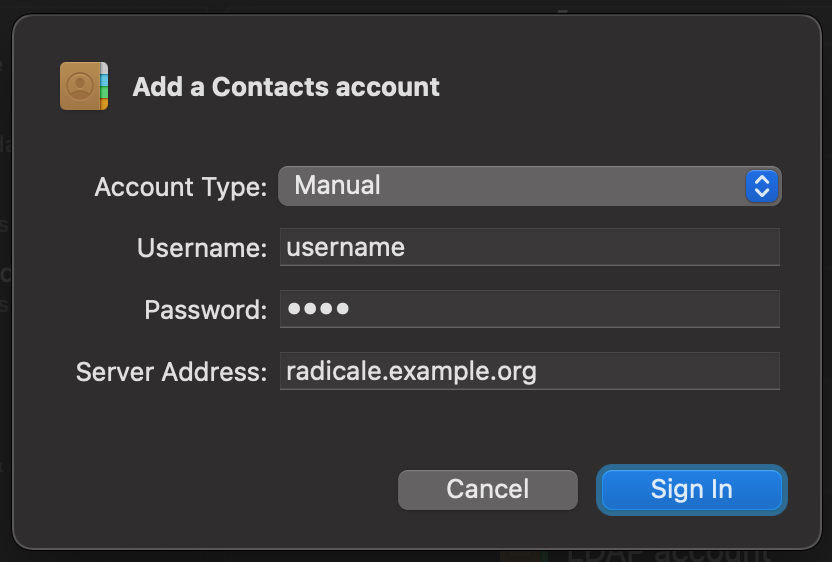

# Docker Radicale

This is a small docker image for [Radicale](https://github.com/Kozea/Radicale) and easy deployment. Bcrypt authentication inclusive.


## Installation

```
# .env
USER=foo
PASSWORD=secret
```

```yml
# docker-compose.yml
version: '3.7'

services:
  app:
    image: cupcakearmy/radicale:1
    restart: unless-stopped
    env_file: .env
    volumes:
      - ./data:/data
    ports:
      - 80:5232
```

The env file is not strictly required, but will generate a user with its bcrypt password if missing.

## macOS Setup

Without SSL/TLS the native client seems to have problems, once SSL is enabled it works like a charm.



The same setup works for Calendar and on iOS.

## Traefik

An example for traefik (v1) can found below.

```yml
version: '3.7'

networks:
  traefik:
    external: true

services:
  app:
    image: cupcakearmy/radicale
    env_file: .env
    volumes:
      - ./data:/data
    networks:
      - traefik
    labels:
      - traefik.enable=true
      - traefik.backend=radicale
      - traefik.frontend.rule=Host:radicale.example.org
      - traefik.docker.network=traefik
      - traefik.port=5232
```

## Customize

### Config

You can overwrite the config by simply mounting it into `/etc/radicale/config`.

### User Auth

The default script only creates a default user with the given `USER` and `PASSWORD` credentials. For multiple users you need to create the files manually. In the default config this is set to `/data/users`.

You can add users with `htpasswd -bB -c /data/users user pass`. And then mount that file to `/data/users` or whatever you have set in the Radicale config file `filesystem_folder`, [more here](https://radicale.org/3.0.html#documentation/configuration/auth/htpasswd_filename).
